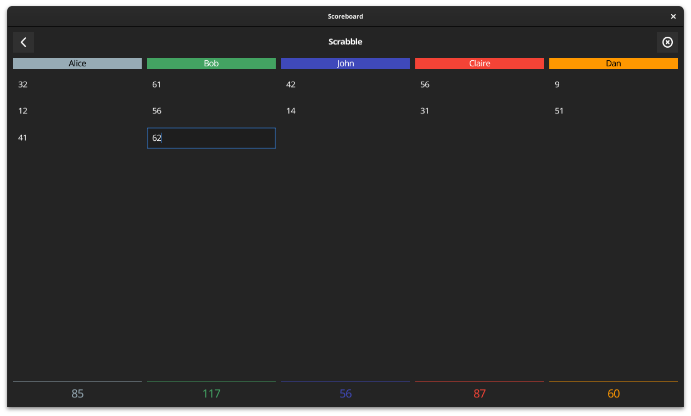

# Scoreboard

A simple scoreboard application to calculate scores while you're playing.

## Why ?

Because I play Scrabble with my wife and I hate to write scores on a paper. Some mobile applications exist, but I wanted the application to be **simple**.

And also, because I love [Fyne.io](https://fyne.io) library, I wanted to present how it is possible to create such application with it.

